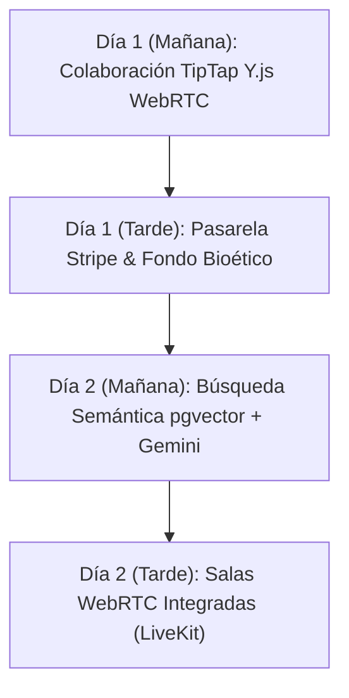

# Documento de Decisiones de Arquitectura (ADR) — Plataforma Anamnesis

Este documento consolida las **5 decisiones técnicas clave de arquitectura**, sus justificaciones, beneficios en producción y las consideraciones de ingeniería adoptadas en la plataforma **Anamnesis** (Next.js 14+, TypeScript, Tailwind CSS, TipTap, Google Gemini AI y Supabase).

---

## 1. Cinco Decisiones Técnicas Clave de Arquitectura

### 1.1. Transacciones Atómicas PostgreSQL RPC con Bloqueo Explícito (`SELECT ... FOR UPDATE`)
* **Contexto**: El agendamiento de sesiones de 30 minutos entre lectores y autores está sujeto a concurrencia crítica (*race conditions*). Si dos lectores intentan reservar simultáneamente la misma ranura de disponibilidad en milisegundos, los bloqueos en el nivel de aplicación (Node.js/Next.js) fallan en entornos distribuidos o serverless.
* **Decisión**: Implementar la lógica transaccional directamente en el motor de PostgreSQL mediante una función RPC (`book_slot_atomic`) utilizando la cláusula `SELECT * FROM availability_slots WHERE id = p_slot_id FOR UPDATE`.
* **Por qué**:
  1. **Aislamiento ACID real**: El motor de PostgreSQL retiene un bloqueo exclusivo sobre la fila (`row lock`). La segunda transacción queda en espera y, al evaluarse, detecta inmediatamente `is_booked = true`.
  2. **Mensajes amigables y controlados**: Retorna un código de error estructurado (`ALREADY_BOOKED`) con el mensaje exacto: *"Este espacio acaba de ser reservado por otro lector. Por favor, selecciona otro horario disponible."*
  3. **Atomicidad completa**: En una sola transacción se verifica el estado, se actualiza el slot y se crea el registro en la tabla `bookings` sin dejar estados intermedios inconsistentes.

---

### 1.2. Editor TipTap con Pipeline de Sanitización (`DOMPurify`), Debounce y Extensiones Propias (Open Library)
* **Contexto**: Los autores redactan manuscritos extensos ("artículos monstruo" de más de 9,000 palabras y más de 30 imágenes) y con frecuencia pegan borradores directamente desde Microsoft Word o Google Docs, arrastrando tags XML propietarios (`mso-*`), estilos en línea corruptos y vectores potenciales de ataque XSS.
* **Decisión**: Utilizar TipTap (wrapper moderno sobre ProseMirror) desacoplado del DOM nativo, complementado con un pipeline de pre-sanitización regex y `DOMPurify`, junto a un cálculo de palabras/lectura debouncado a 250ms fuera del hilo crítico.
* **Por qué**:
  1. **Modelo AST Robusto**: ProseMirror procesa el documento como un árbol de sintaxis abstracta tipado, impidiendo la inyección de nodos maliciosos.
  2. **Sanitización de Word sin pérdida estilística**: Filtra etiquetas propietarias de Microsoft Office preservando cursivas, negritas, citas y transformando código en bloques `<pre><code>`.
  3. **Rendimiento a 60 FPS**: El canvas no re-renderiza todo el documento en cada pulsación; el autoguardado a 5 segundos (`isDirty`) corre en segundo plano sin interrumpir la experiencia de escritura.
  4. **Extensión Open Library**: Permite consultar la API pública e incrustar tarjetas de citas bibliográficas con portada y metadatos sin romper el flujo del documento.

---

### 1.3. Integración de Google Gemini API (`@google/genai`) Exclusivamente en Servidor con Degradación Elegante (*Graceful Degradation*)
* **Contexto**: El asistente editorial automatizado requiere acceso a modelos LLM avanzados para proponer títulos, extractos y etiquetas. La exposición de la API Key en el cliente representa un riesgo crítico de seguridad y abuso de cuota.
* **Decisión**: Crear una API Route dedicada (`POST /api/ai/suggest`) que utiliza el SDK oficial `@google/genai` con el modelo `gemini-2.5-flash` desde el entorno seguro de Node.js. Si la API Key no está configurada, falla la red o se supera la cuota, la ruta activa un mecanismo de degradación elegante devolviendo un fallback editorial local con código 200 y bandera `isFallback: true`.
* **Por qué**:
  1. **Regla Dura de Seguridad**: Cero variables `NEXT_PUBLIC_` para proveedores externos de IA o correo (`GEMINI_API_KEY`, `RESEND_API_KEY`, `SUPABASE_SERVICE_ROLE_KEY` residen 100% en backend).
  2. **Experiencia de Usuario sin Bloqueos**: Si el servicio de IA no responde, el editor no se congela ni arroja errores fatales; muestra un banner ligero: *"Servicio de IA no disponible temporalmente"* permitiendo al autor continuar redactando sin obstáculos.

---

### 1.4. Estrategia Universal de Husos Horarios (ISO 8601 UTC en Base de Datos + `Intl.DateTimeFormat` en Cliente) y RFC 5545 `.ics`
* **Contexto**: La comunidad de Anamnesis congrega autores y lectores de múltiples países (México, Colombia, Argentina, Chile, España, EE.UU.). Almacenar fechas en horas locales o depender de husos del servidor genera desfases de citas y errores de calendario.
* **Decisión**:
  1. Todos los timestamps de disponibilidad y reservas se persisten estrictamente en formato ISO 8601 UTC (`YYYY-MM-DDTHH:mm:ss.sssZ`).
  2. En el cliente, la función nativa `Intl.DateTimeFormat` convierte dinámicamente cada ranura al huso horario detectado del lector o al huso seleccionado en el dropdown interactivo.
  3. Generar eventos de calendario conformes al estándar RFC 5545 (`.ics`) descargables tanto por el autor como por el lector.
* **Por qué**:
  1. **Cero ambigüedad horaria**: Elimina discrepancias por horario de verano (*daylight saving time*).
  2. **Claridad para ambas partes**: El lector visualiza la cita en su hora local (ej. 10:00 CDMX) y el autor en la suya (ej. 11:00 Bogotá), evitando inasistencias.
  3. **Regla de Cancelación Precisa**: Permite evaluar matemáticamente si faltan $\ge 2\text{h}$ ($7200\text{s}$) comparando marcas de tiempo absolutas.

---

### 1.5. Tipografía Optimizada para Lectura Larga con Tailwind Typography (`prose`) y Barra de Scroll Reactiva
* **Contexto**: Anamnesis es una plataforma enfocada en la literatura, el ensayo clínico y la crónica narrativa, géneros que exigen periodos prolongados de lectura inmersiva en pantallas móviles y de escritorio.
* **Decisión**: Integrar `@tailwindcss/typography` con clases `prose prose-lg dark:prose-invert font-serif`, drop-caps flotantes, citas en bloque estilizadas, barra de progreso superior reactiva al desplazamiento de la ventana y controles de ajuste tipográfico (tamaño de fuente y Serif/Sans).
* **Por qué**:
  1. **Ergonomía visual y descanso ocular**: Garantiza un ritmo vertical y un ancho de línea óptimo (65 a 75 caracteres por línea) evitando la fatiga visual.
  2. **Orientación al lector**: La barra de progreso superior informa sutilmente el avance en textos de más de 3,000 palabras sin recurrir a elementos flotantes invasivos.
  3. **Accesibilidad y adaptabilidad**: Permite al lector ajustar el tamaño tipográfico de acuerdo a sus preferencias y dispositivo.

---

## 2. Funcionalidad Recortada por Tiempo y Plan de Implementación (2 Días Adicionales)

Si dispusiéramos de **48 horas adicionales de ingeniería**, se implementarían las siguientes 4 características de alto impacto:

### 2.1. Colaboración Multiautor en Tiempo Real con CRDTs (TipTap + Y.js + WebRTC)
* **Objetivo**: Permitir que el autor y el editor del círculo trabajen sobre el mismo manuscrito en vivo con cursores de presencia y resolución matemática de conflictos.
* **Cómo se implementaría**:
  1. Integrar `@tiptap/extension-collaboration` y `@tiptap/extension-collaboration-cursor` vinculados a un servidor de señalización WebSockets (Hocuspocus o Supabase Realtime Broadcast).
  2. Almacenar el estado del documento como un binario Y.Doc persistido en PostgreSQL, garantizando sincronización sin pérdidas entre desconexiones.

### 2.2. Pasarela de Pagos & Fondo Editorial con Stripe Checkout & Webhooks Idempotentes
* **Objetivo**: Habilitar micropagos y suscripciones a círculos editoriales para remunerar las mentorías de 30 minutos de los autores y fondear publicaciones impresas.
* **Cómo se implementaría**:
  1. Server Action con `stripe.checkout.sessions.create` vinculando `booking_id` y `author_id`.
  2. Endpoint `/api/webhooks/stripe` con validación de firma criptográfica (`stripe.webhooks.constructEvent`) y tabla de eventos idempotentes en Supabase para evitar doble acreditación.

### 2.3. Búsqueda Semántica Vectorial con `pgvector` y Google Gemini Embeddings
* **Objetivo**: Permitir a los lectores buscar ensayos no solo por coincidencia literal de palabras, sino por afinidad conceptual y filosófica (ej. *"manuscritos que hablen sobre la soledad del paciente terminal"*).
* **Cómo se implementaría**:
  1. Habilitar la extensión `vector` en Supabase PostgreSQL y agregar la columna `embedding vector(768)` a la tabla `articles`.
  2. Al publicar un artículo, generar su vector con `@google/genai` (`embedding-001` / `text-embedding-004`) y almacenarlo.
  3. Crear la función RPC `match_articles_semantic` con similitud de coseno (`<=>`) y un índice IVFFlat / HNSW.

### 2.4. Salas de Teleconferencia WebRTC Nativas (LiveKit / Daily.co) con Grabación de Sesiones
* **Objetivo**: Embeber la videollamada de 30 minutos directamente dentro de la plataforma en `/sala-virtual/[id]` sin depender de software externo.
* **Cómo se implementaría**:
  1. Token server-side generado mediante LiveKit SDK validando que el usuario autenticado sea el `reader_id` o `author_id` de la reserva.
  2. Componente de sala con control de cámara, micrófono, temporizador de 30 minutos con cuenta regresiva y transcripción automática de notas de la sesión.

---

## 3. Matriz de Entregables y Estado del Proyecto

| Módulo / Requerimiento | Estado | Archivos Principales de Referencia |
| :--- | :---: | :--- |
| **Esquema PostgreSQL + RLS** | **Completado** | `supabase/migrations/*`, `supabase/seed.sql` |
| **Círculos Dinámicos & Mesa Editorial** | **Completado** | `/circulo/[slug]`, `/circulo/[slug]/editor/members` |
| **Editor TipTap + DOMPurify + Open Library** | **Completado** | `/editor/[id]`, `src/lib/editor/sanitize.ts` |
| **Agendamiento 30 min + Atomic Row-Lock** | **Completado** | `/agenda`, `/dashboard/autor/disponibilidad`, `20240103000000_atomic_booking_system.sql` |
| **Google Gemini AI (@google/genai)** | **Completado** | `/api/ai/suggest`, `ai-assistant-modal.tsx` |
| **Resend Emails & Supabase Storage** | **Completado** | `/api/email/*`, `/api/storage/upload` |
| **Lectura Larga + Tailwind Prose + Bookmarks** | **Completado** | `/circulo/[slug]/articulos/[articleSlug]`, `article-search-filter.tsx` |
| **Búsqueda Debounce 300ms + Filtros** | **Completado** | `/explorar`, `article-search-filter.tsx` |
| **Comentarios Realtime + Moderación** | **Completado** | `comment-thread-section.tsx`, `mock-db.ts` |
